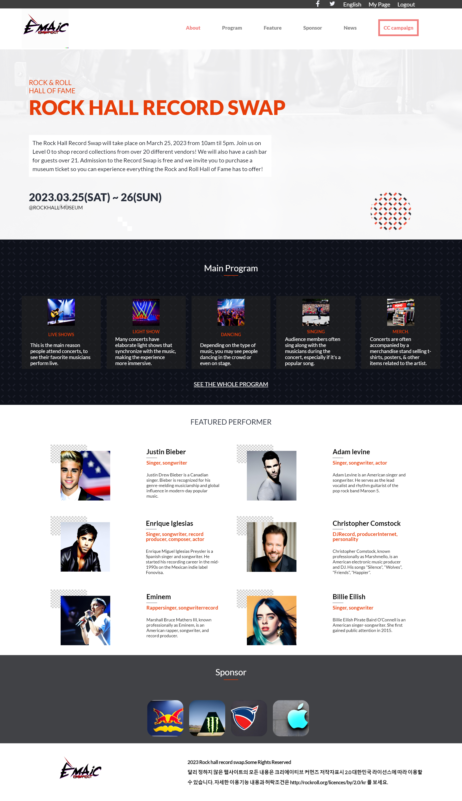
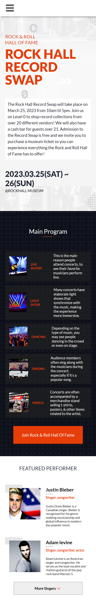

  
   

  <h3><b>MUSICAL CONCERT PROJECT</b></h3>

<!-- TABLE OF CONTENTS -->

# 📗 Table of Contents

- [📖 About the Project](#about-project)
  - [🛠 Built With](#built-with)
    - [Tech Stack](#tech-stack)
    - [Key Features](#key-features)
  - [🚀 Live Demo](#live-demo)
- [💻 Getting Started](#getting-started)
  - [Setup](#setup)
  - [Prerequisites](#prerequisites)
  - [Install](#install)
  - [Usage](#usage)
  - [Run tests](#run-tests)
  - [Deployment](#triangular_flag_on_post-deployment)
- [👥 Authors](#authors)
- [🔭 Future Features](#future-features)
- [🤝 Contributing](#contributing)
- [⭐️ Show your support](#support)
- [🙏 Acknowledgements](#acknowledgements)
- [❓ FAQ (OPTIONAL)](#faq)
- [📝 License](#license)

<!-- PROJECT DESCRIPTION -->

# 📖 [Rock music concert project] 

- Project Description:

  - The project is a Rock music concert website.
  - It has been built using HTML, CSS, and JavaScript.
  - The project utilizes Flexbox and Grid layout techniques to create a responsive design that adapts to different screen sizes.
  - Media queries have been used in CSS to optimize the website for different screen resolutions.
  - Proper semantic HTML tags have been used to structure the content of the website.
  - The website has dynamic and interactive features that have been created using JavaScript and the Document Object Model (DOM).

**[Rock music concert project]** Rock music is a broad genre of popular music that originated as "rock and roll" in the United States in the late 1940s and early 1950s, developing into a range of different styles in the mid-1960s and later, particularly in the United States and United Kingdom.

## 🛠 Built With 

### Tech Stack 

- Tech Stack:

  - Front-end: HTML, CSS, JavaScript, Flexbox, Grid, Media Queries, Semantic HTML.
  - Back-end: Not applicable as the project is a static website.
  - Database: Not applicable as the project is a static website.
  - Deployment: The website can be hosted on a web server or using a static site generator like Github Pages.

  
HTML

  <ul>
    <li><a href="https://www.w3schools.com/html/">HTML5</a></li>
  </ul>

  
CSS

  <ul>
    <li><a href="https://www.w3schools.com/Css/">CSS3</a></li>
  </ul>

Javascript

  <ul>
    <li><a href="https://javascript.info/">Javascript</a></li>
  </ul>

<!-- Features -->

### Key Features 

- Key Features:

  - **[Responsive Design]** The use of Flexbox, Grid, and Media Query in CSS and semantic HTML tags make the website responsive, ensuring it adapts to different screen sizes and devices.
  - **[Interactivity]** The use of JavaScript and DOM manipulation improves the interactivity of the website, allowing users to interact with the website's content dynamically.
  - **[Visual Appeal]** The combination of CSS and HTML techniques creates a visually appealing website, enhancing the user experience.

(<a href="#readme-top">back to top</a>)

<!-- LIVE DEMO -->

## 🚀 Live Demo 

- [Live Demo Link](https://chandan-devs-tech.github.io/Capstone-Project-MUSICAL-CONCERT-PAGE/)

- Desktop Version

  

- Mobile Version

  

(<a href="#readme-top">back to top</a>)

<!-- GETTING STARTED -->

## 💻 Getting Started 

- New Developer Usage: To get a local copy up and running, follow these steps:

  - Clone the repository to your local machine.
  - Open the project directory in a code editor.
  - Open the index.html file in a web browser to view the website.
  - Make changes to the HTML, CSS, or JavaScript files to modify the website as needed.

### Prerequisites

- A web browser: You will need a modern web browser such as Google Chrome, Mozilla Firefox, or Safari to view and test your project.
- A code editor: You will need a code editor such as Visual Studio Code, Sublime Text, or Atom to write, edit, and manage your project's files.
- A local server: You will need a local server such as XAMPP or WAMP to run your project locally and test it on your own computer.
- Knowledge of HTML, CSS, and JavaScript: You will need to have a basic understanding of HTML, CSS, and JavaScript in order to build a web development project.
- Familiarity with Git and GitHub: If you are using Git and GitHub to manage your project's codebase, you will need to be familiar with how to use them.

### Setup

- Open a command-line interface (e.g. Terminal on Mac or Linux, Command Prompt on Windows).
- Navigate to the folder where you want to clone the repository using the cd command.
- Use the git clone command followed by the repository's URL to clone the repository. For example:
  git clone https://github.com/Chandan-devs-tech/Capstone-project.git
- Press enter and wait for the repository to finish cloning.

### Install

- Clone the repository to your local machine using the git clone command as described in the previous answer.
- Navigate to the project folder using a command-line interface such as Terminal or Command Prompt.
- Install any necessary dependencies using a package manager such as NPM or Yarn. You can do this by running the npm install or yarn install command in the project folder.
- Start the local server using a command such as npm start or yarn start, depending on the project's setup.
- Open a web browser and navigate to the local server's URL to view and test the project.

### Usage

- Assuming that you have installed the project's dependencies and started the local server, you can run the project by following these steps:

  - Open a web browser such as Google Chrome, Mozilla Firefox, or Safari.
  - In the address bar, type the URL of the local server that you started in the previous step. This will typically be something like http://localhost:3000.
  - Press enter to navigate to the local server's URL.
  - The project should now be running in your web browser. Use the website's interface to interact with the project and test its functionality.

### Run tests

- To run tests for a web development project, follow these steps:

  - Open a command-line interface such as Terminal or Command Prompt.
  - Navigate to the project folder using the cd command.
  - Run the appropriate testing command for your project. This may vary depending on the project's testing framework and setup. For example, you may need to run a command like npm test or yarn test, or you may need to run tests for specific files or modules using a command like pytest path/to/test_file.py.
  - Wait for the tests to finish running. Depending on the size and complexity of your project, this may take several minutes.
  - Check the output of the tests to see if there are any failures or errors. If there are, you may need to modify your code to fix the issues and re-run the tests.

### Deployment

- Project is deployed using [GitHub Pages](https://pages.github.com/)
- [🚀 Live Demo Link Provided Above ⬆️](#live-demo)

(<a href="#readme-top">back to top</a>)

<!-- AUTHORS -->

## 👥 Authors 

👤 **Author**

- GitHub: [Chanadan Gupta](@Chandan-devs-tech)
- Twitter: [Chandan Gupta](@ChandanGuptaDev)
- LinkedIn: [Chandan Gupta](www.linkedin.com/in/chandangupta-devs)
- Slack: [Chandan Gupta](@ChandanGupta)

(<a href="#readme-top">back to top</a>)

<!-- FUTURE FEATURES -->

## 🔭 Future Features 

- The features I will add to the project are :

  - [ ] **[Improve mobile responsiveness]**
  - [ ] **[Integration with a back-end database]**
  - [ ] **[User authentication and account creation]**

(<a href="#readme-top">back to top</a>)

<!-- CONTRIBUTING -->

## 🤝 Contributing 

- Understand the project's goals: Before I start contributing to a project, it's important to understand its goals, scope, and target audience. Read the project's documentation and review its codebase to get a sense of what it does and how it works.

- Review existing issues: Check the project's issues page to see if there are any open issues that you can help with. Look for issues that match my skillset or interests, and read through the discussion to understand the problem and any proposed solutions.

- Create a new issue: If you I find an existing issue that matches your contribution, consider creating a new one. sure about the problem or feature request clearly and provide any relevant details or context.

- Fork the repository: If I ready to start contributing code, fork the project's repository on GitHub. This will create a copy of the project that I can work on independently.

- Submit a pull request: When I am ready to submit my changes back to the main project, create a pull request on GitHub. Sure about the changes clearly and provide any relevant details or context.

(<a href="#readme-top">back to top</a>)

<!-- SUPPORT -->

## ⭐️ Show your support 

- If you like this project, please consider showing your support by starring the repository on GitHub! Your star helps to increase the project's visibility and encourages others to use and contribute to it. Additionally, if you find any issues or have any feature requests, please don't hesitate to submit them to the project's issues page. Your feedback and contributions are greatly appreciated and help to make the project better for everyone. Thank you for your support!

(<a href="#readme-top">back to top</a>)

<!-- ACKNOWLEDGEMENTS -->

## 🙏 Acknowledgments 

- I would like to express my gratitude to the following individuals and resources who have inspired and contributed to this project:

  - [SanaTameem](https://www.linkedin.com/in/sana-tameem-a63b55240/)
  - [Nemwel Boniface](https://twitter.com/nemwel_bonie)

- Their work and insights have helped me to develop my skills and understanding, and have contributed to the success of this project. I also want to thank the Microverse community for their collective efforts in making software development accessible and collaborative.

(<a href="#readme-top">back to top</a>)

<!-- FAQ (optional) -->

## ❓ FAQ (OPTIONAL) 

[Question_1]

- How can I customize the visual design of the Rock music concert project to fit my specific needs?

  - [Answer_1]

    - The visual design of the Rock music concert project can be customized by modifying the CSS code. The project utilizes a combination of flexbox, grid, and media queries to create a responsive layout, and semantic HTML tags to provide structure and accessibility. By tweaking the values of CSS properties such as colors, fonts, and layout rules, you can adjust the look and feel of the project to match your preferences. Additionally, you can add or remove content within the HTML and JavaScript files to tailor the project to your specific use case.

[Question_2]

- How can I add new functionality to the Rock music concert project, such as a feature to purchase tickets?

  - [Answer_2]

    - The Rock music concert project is built using JavaScript, which allows for a wide range of custom functionality to be added. To add a feature such as ticket purchasing, you can start by modifying the JavaScript code to create a new function or class that handles the logic of the feature. You may also need to modify the HTML and CSS to add new UI elements and styles that support the new feature. Additionally, you may want to consider integrating third-party libraries or APIs that provide additional functionality, such as payment processing or event scheduling.

(<a href="#readme-top">back to top</a>)

<!-- LICENSE -->

## 📝 License 

- This project is [Creative Commons](https://creativecommons.org/licenses/by-nc/4.0/) licensed.

(<a href="#readme-top">back to top</a>)

